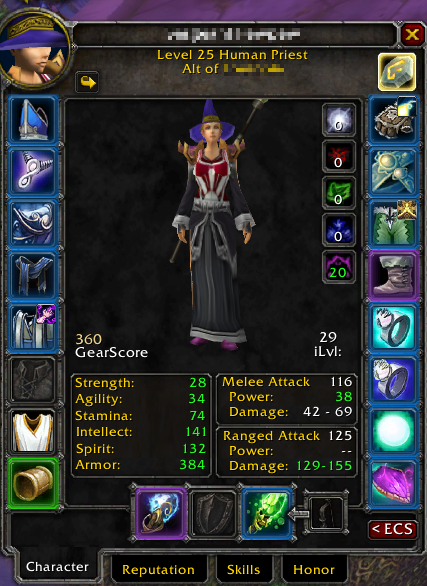

### Download from the official [CurseForge website](https://www.curseforge.com/wow/addons/gearscoreclassic)

### This addon can be used instead of other popular gearscore addons as it produces similar values but fixes some bugs in the calculation process.  
--- 
GearScoreClassic+
------------------

**GearScoreClassic+ is a maintained addon for World of Warcraft Classic (Season of Discovery). It is designed to calculate and display a gear score (GS) for both your character and any character you inspect (or hover over).  
It will be maintained and updated with new features for the upcoming phases with simplicity and efficiency in mind.**

## Purpose

GearScoreClassic+ offers a general metric that represents the overall quality of a player's gear. This metric, known as Gear Score (GS), is calculated based on various attributes of each equipped item, including its item level, enchantments, and specific slot modifiers.  

## Calculation

The Gear Score is calculated using the following methodology:

1. **Item Level and Slot Modifier**: Each item's base score is derived from its item level, modified by a predefined factor based on the item's slot (e.g., head, chest, weapon). Different slots have different impacts on the overall score, reflecting their varying importance.

2. **Enchantments**: Items that are enchantable and have enchantments contribute additional points to the gear score. This aspect of the calculation acknowledges the added value that enchantments bring to gear.

## Features

1. **Average Item Level (iLvl)**: Alongside the gear score, the addon also calculates and displays the average item level of the equipped gear. This provides an additional metric for evaluating gear quality.

2. **Character Frame Integration**: GearScoreClassic seamlessly integrates with the WoW Classic character frame and InspectFrame, displaying gear score and average item level.

4. **Colored GearScore**: GearScore will be colored based on its percentile to a score considered very high for this phase similar to WarCraftLogs.

## Usage

Simply install the addon, and it will automatically display gear scores in the character and inspect frames. There are no additional commands or configurations yet.
